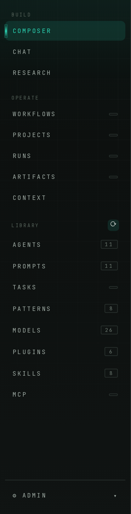
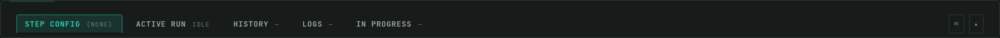
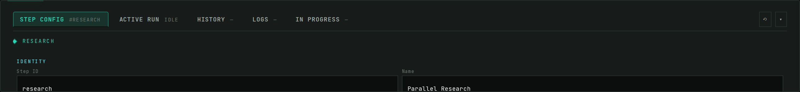

<p align="center">
  
</p>

<h1 align="center">Enclave</h1>

<p align="center">
  Self-hosted LLM infrastructure with OpenAI-compatible API. CPU-optimized. Source-available.
</p>

<p align="center">
  <a href="https://github.com/hankthebldr/local-ai-platform/releases/latest"></a>
  <a href="https://github.com/hankthebldr/local-ai-platform/releases?q=prerelease%3Atrue&expanded=true"></a>
  <a href="https://github.com/hankthebldr/local-ai-platform/actions/workflows/ci.yml"></a>
  <a href="https://hub.docker.com/r/hankthebldrr/local-ai-platfrom"></a>
  <a href="https://github.com/hankthebldr/local-ai-platform/pkgs/container/enclave"></a>
  
  
</p>

<p align="center">
  <a href="https://hankthebldr.github.io/local-ai-platform/"><strong>Product page</strong></a> ·
  <a href="https://github.com/hankthebldr/local-ai-platform/wiki"><strong>Wiki</strong></a> ·
  <a href="https://github.com/hankthebldr/local-ai-platform/releases/latest"><strong>Latest release</strong></a> ·
  <a href="CHANGELOG.md"><strong>Changelog</strong></a>
</p>

---

Enclave runs LLMs on your hardware. OpenAI-compatible API, Ollama backend, zero cloud dependencies.

> **What's new** — Architecture-aware orchestration (Phases 1–6): per-host detection of memory + deployment topology, four-tier `keep_alive` resolver with arch-detected defaults, scheduler facade with feasibility validation, and tick-based **parallel DAG dispatch** that uses the arch to decide what to run concurrently. Plus: installable Python wheel + sdist, mirrored Docker image on GHCR, Linux source tarball with SHA256/SHA512, n8n release-update workflow, and a curated Wiki seed. See the [CHANGELOG](CHANGELOG.md) for the full PR-by-PR detail.

## What it does

- **OpenAI-compatible API** — drop-in replacement. Point your existing code at `localhost:8000`
- **CPU-optimized inference** — GGUF quantized models via Ollama. 7B at 40-50 tok/s, 13B at 25-30 tok/s
- **Model management** — download, configure, and switch between 18+ models from the registry
- **Multi-agent workflows** — YAML-defined step pipelines with role-based model selection
- **Web dashboard** — monitor models, system health, and API status
- **macOS app** — native desktop wrapper with setup wizard
- **No telemetry by default** — no data leaves your machine unless you opt in; optional, operator-owned error reporting (your own sink, redaction mandatory — see [docs/deployment/error-reporting.md](docs/deployment/error-reporting.md)). No internet required for inference

## Console

A single-operator web console (warm-charcoal + teal) runs the whole local stack — Composer, workflows, runs, and a Library of models, skills, MCP servers, plugins, agents, prompts, tasks, and patterns. See it live on the [product page](https://hankthebldr.github.io/local-ai-platform/#console).

**Recent UI work:**

- **One-click inventory refresh** — the Library rail reloads every installed kind and its count badges from a single ⟳. Installing from the marketplace or generating an agent now auto-refreshes the affected badges, so the counts always reflect what's actually installed.
- **Collapsible Composer workstream** — the bottom strip (Step Config · Active Run · History · Logs · In Progress) defaults to a tabs-only preview and expands *in place* — on a tab click or a canvas-node select — for full detail.

<p>
  
</p>

The Library rail: a global **⟳** refresh on the section header, and per-kind count badges that stay truthful as you install, generate, or uninstall components.

<br clear="all">



<sub>**Composer workstream — minimized** to a tabs-only preview, giving the canvas the vertical room.</sub>



<sub>**… expands for detail** — selecting a canvas node opens that step's live configuration in place.</sub>

## Quick start

Three paths — pick one:

### macOS app (DMG) — for end users

1. Download **Enclave.dmg** from the [latest release](https://github.com/hankthebldr/local-ai-platform/releases/latest)
   *(Or grab the rolling [nightly build](https://github.com/hankthebldr/local-ai-platform/releases/tag/nightly) for the freshest `dev`.)*
2. Open the DMG and drag **Enclave.app** to `/Applications`.
3. First launch: macOS Gatekeeper will warn — the app is currently **not signed/notarized**. Bypass once with:
   ```bash
   xattr -dr com.apple.quarantine /Applications/Enclave.app
   ```
   Then double-click **Enclave** in Launchpad.
4. The native window opens the **first-run setup wizard** (`/setup`) which installs Ollama if needed and pulls a starter model. After that you land on the dashboard.

> **Requirements:** macOS 12.0 (Monterey) or later. ~6 GB free disk for the bundled runtime + a small starter model. Ollama is installed automatically by the wizard if missing.

### Docker — any platform with Docker Desktop

For non-developers on Linux / Windows, or anyone who wants Enclave fully isolated in containers. No Python, no virtualenv, no manual Ollama install.

1. Install [Docker Desktop](https://www.docker.com/products/docker-desktop/) (or Docker Engine on Linux) and make sure the whale icon is running.
2. Clone or download this repo, open a terminal in the project folder, and run:
   ```bash
   ./run.sh
   ```
3. The script verifies Docker, brings up the stack (`ollama` + `api`), pulls a small starter model on first run (`llama3.2:3b`, ~2 GB), and opens the dashboard in your browser.

| | URL |
|---|---|
| **Enclave SPA** (the application) | `http://localhost:8000` |
| API docs                          | `http://localhost:8000/docs` |
| Open WebUI (opt-in)               | `http://localhost:8081` — `docker compose -f docker-compose.yml -f docker-compose.webui.yml up -d` |

To stop: `./stop.sh` (data preserved) — or `./stop.sh --reset` to wipe models and chat history.

> **Requirements:** ~4 GB free RAM and ~3 GB free disk for the starter model. Pick a different starter with `ENCLAVE_DEFAULT_MODEL=qwen2.5:3b ./run.sh`.

Prefer to pull the published image directly? (Substitute `<version>` with the latest tag.)

```bash
# Docker Hub — canonical
docker pull hankthebldrr/local-ai-platfrom:<version>

# GHCR mirror — same digest, no Hub account required
docker pull ghcr.io/hankthebldr/enclave:<version>
```

### pip install — embed in an existing Python app

For developers who want to use the Enclave engine inside another Python service. Bundles the FastAPI app, workflow engine, RAG pipeline, and CLI dispatcher.

```bash
# From a GitHub Release asset (no PyPI required)
pip install https://github.com/hankthebldr/local-ai-platform/releases/download/v<version>/enclave-<version>-py3-none-any.whl

# Then run the API server with the same uvicorn settings the DMG uses:
enclave-api                 # starts FastAPI on 127.0.0.1:8000
enclave --help              # CLI dispatcher (chat, workflow, query, api)
```

You still need an Ollama runtime reachable at `OLLAMA_URL` (defaults to `http://localhost:11434`). The Python package does **not** install Ollama for you — see the [Wiki › Deployment](https://github.com/hankthebldr/local-ai-platform/wiki/Deployment) page for production setups.

### From source — for developers

```bash
# Install (creates ./venv, installs core+dev deps, sets up systemd unit on Linux)
./setup/install.sh

# Boot Ollama + API + auto-open the dashboard in your browser
./scripts/start.sh

# Or, on macOS, exercise the same native pywebview window the DMG ships
./scripts/start_desktop.sh

# Verify everything boots and every UX route renders
./scripts/verify_local.sh
```

API at `http://localhost:8000` · Dashboard at `http://localhost:8000/` · Docs at `http://localhost:8000/docs` · First-run wizard at `http://localhost:8000/setup`.

## Models

```bash
# List available models
python models/download.py --list

# Download a model
python models/download.py dolphin-mixtral

# List installed
ollama list
```

Default quantization: Q4_K_M (best quality/speed balance). See [MODELS.md](MODELS.md) for the full registry.

## API usage

```bash
curl http://localhost:8000/v1/chat/completions \
  -H "Content-Type: application/json" \
  -d '{
    "model": "mistral",
    "messages": [{"role": "user", "content": "Hello"}]
  }'
```

Compatible with any OpenAI SDK client.

## Code-level artifacts

What ships in this repo, and where to find it:

| Surface | Path | Notes |
|---|---|---|
| FastAPI server (OpenAI-compatible) | [api/main.py](api/main.py) | 16 routers under `api/routers/`, services under `api/services/` |
| Web dashboard + setup wizard | [api/static/](api/static/) | Served at `/` and `/setup` by the FastAPI app |
| CLI chat / query / workflow | [cli/](cli/) | Rich-formatted; `python -m cli.chat`, `cli/workflow.py` |
| Multi-agent workflow engine | [api/services/workflow_engine.py](api/services/workflow_engine.py) | YAML pipelines under [workflows/](workflows/) |
| Custom agents (Gems) | [agents/](agents/) + [api/routers/agents.py](api/routers/agents.py) | YAML-defined personas with pinned context |
| Model registry | [models/download.py](models/download.py) | 18+ models — see [MODELS.md](MODELS.md) |
| macOS desktop wrapper | [desktop/app.py](desktop/app.py) | pywebview window around the FastAPI server |
| DMG builder | [scripts/build_mac.sh](scripts/build_mac.sh) | Bundles a self-contained `.app` + dmg |
| Local dev scripts | [scripts/](scripts/) | `start.sh`, `start_desktop.sh`, `verify_local.sh`, `status.sh`, `test.sh` |

### Build the DMG yourself

The same script CI uses on tag pushes:

```bash
brew install librsvg create-dmg     # one-time
./scripts/generate-icons.sh         # regenerate icns from SVG
./scripts/build_mac.sh              # produces dist/Enclave.app + dist/Enclave.dmg
open dist/Enclave.app               # smoke-test the bundle
```

The build script reads `ENCLAVE_VERSION` (or falls back to `git describe`) and stamps it into `Info.plist`. Override for a one-off custom build:

```bash
ENCLAVE_VERSION=v1.2.3-local ./scripts/build_mac.sh
```

### Release pipeline

`dev` is the integration trunk and the default branch; `main` is the release
surface. See [docs/BRANCHING.md](docs/BRANCHING.md).

| Trigger | Workflow | Artifact |
|---|---|---|
| PR / push to `dev` or `main` | [ci.yml](.github/workflows/ci.yml) | pytest + lint + macOS `.app` smoke build (boots and probes UX routes) |
| Push to `dev` | [release.yml](.github/workflows/release.yml) | Rolling `nightly` pre-release (replaced each merge) · Docker `edge`, `dev-<sha>` |
| **Merge into `main`** | [release.yml](.github/workflows/release.yml) | Tags `vX.Y.Z` and cuts the stable Release: DMG + wheel + sdist + tarball + checksums · Docker `X.Y.Z`, `latest` |
| Tag push `v*.*.*` | [release.yml](.github/workflows/release.yml) | Same stable Release, cut by hand |
| Push to `main` or release publish | [pages.yml](.github/workflows/pages.yml) | Updates [hankthebldr.github.io/local-ai-platform](https://hankthebldr.github.io/local-ai-platform/) with the latest release version |

Every merge into `dev` re-publishes a freshly smoke-tested DMG to the [`nightly`](https://github.com/hankthebldr/local-ai-platform/releases/tag/nightly) release. A stable release is cut by merging `dev → main`: CI reads `__version__` from `api/__init__.py`, tags it, and publishes. If that tag already exists the release is skipped rather than overwritten, so a docs-only merge can't clobber a shipped version.

## Hardware targets

| Machine | RAM | Role | Throughput |
|---------|-----|------|------------|
| Mac M4 Pro | 48GB | Development | 7B @ 50 tok/s |
| MS-01 (Ryzen 9 7945HX) | 64GB | API serving | 34B @ 12 tok/s |
| BD790i (Ryzen 9 7945HX) | 96GB | Research / 70B-class workflows | 70B @ 5 tok/s |

The BD790i is the only host in the fleet that can exercise the full
1.3.0 MCP & Skills co-scheduler against 70B-class models + multi-GB
MCP RSS simultaneously. Bring-up + benchmark recipes:
[docs/deployment/bd790i-testing.md](docs/deployment/bd790i-testing.md).

## Documentation

The canonical operator-facing docs live on the [GitHub Wiki](https://github.com/hankthebldr/local-ai-platform/wiki) (sourced from [docs/wiki/](docs/wiki/) on every tag). Highlights:

- [Quickstart](https://github.com/hankthebldr/local-ai-platform/wiki/Quickstart) — first 60 seconds
- [Architecture](https://github.com/hankthebldr/local-ai-platform/wiki/Architecture) — request flow, services, workflow engine, arch-aware dispatch
- [Workflows](https://github.com/hankthebldr/local-ai-platform/wiki/Workflows) — authoring YAML pipelines + composite step kinds
- [Agents](https://github.com/hankthebldr/local-ai-platform/wiki/Agents) — Gems-style YAML personas
- [Models](https://github.com/hankthebldr/local-ai-platform/wiki/Models) — registry, quantization, throughput
- [Deployment](https://github.com/hankthebldr/local-ai-platform/wiki/Deployment) — DMG · Docker · pip · source · systemd
- [Configuration](https://github.com/hankthebldr/local-ai-platform/wiki/Configuration) — env vars, auth, CORS, perf knobs
- [Troubleshooting](https://github.com/hankthebldr/local-ai-platform/wiki/Troubleshooting) — common failure modes
- [Release notes](https://github.com/hankthebldr/local-ai-platform/wiki/Release-Notes)

Source-of-truth references inside the repo:

- [MODELS.md](MODELS.md) — model registry and selection
- [CLAUDE.md](CLAUDE.md) — developer guide
- [CHANGELOG.md](CHANGELOG.md) — every release, every PR
- [docs/](docs/) — design docs, plans, deployment guides
- Product page: [hankthebldr.github.io/local-ai-platform](https://hankthebldr.github.io/local-ai-platform/)
